Exploratory Data Analysis
================
Morris M. F. Chan

-   <a href="#exploratory-data-analysis"
    id="toc-exploratory-data-analysis">Exploratory Data Analysis</a>
    -   <a href="#general" id="toc-general">General</a>
        -   <a href="#importing-packages-and-data"
            id="toc-importing-packages-and-data">Importing packages and data</a>
    -   <a href="#individual-variables" id="toc-individual-variables">Individual
        Variables</a>
        -   <a href="#loanstatus" id="toc-loanstatus"><code>LoanStatus</code></a>
        -   <a href="#borrstate" id="toc-borrstate"><code>BorrState</code></a>
        -   <a href="#cdc_state" id="toc-cdc_state"><code>CDC_State</code></a>
        -   <a href="#thirdpartylender_state"
            id="toc-thirdpartylender_state"><code>ThirdPartyLender_State</code></a>
        -   <a href="#approvalfiscalyear"
            id="toc-approvalfiscalyear"><code>ApprovalFiscalYear</code></a>
        -   <a href="#deliverymethod"
            id="toc-deliverymethod"><code>DeliveryMethod</code></a>
        -   <a href="#naicscode" id="toc-naicscode"><code>NaicsCode</code></a>
        -   <a href="#franchisecode-and-franchisename"
            id="toc-franchisecode-and-franchisename"><code>FranchiseCode</code> and
            <code>FranchiseName</code></a>
        -   <a href="#projectstate"
            id="toc-projectstate"><code>ProjectState</code></a>
        -   <a href="#businesstype"
            id="toc-businesstype"><code>BusinessType</code></a>
        -   <a href="#businessage" id="toc-businessage"><code>BusinessAge</code></a>
        -   <a href="#thirdpartydollars"
            id="toc-thirdpartydollars"><code>ThirdPartyDollars</code></a>
        -   <a href="#grossapproval"
            id="toc-grossapproval"><code>GrossApproval</code></a>
        -   <a href="#terminmonths"
            id="toc-terminmonths"><code>TermInMonths</code></a>
        -   <a href="#grosschargeoffamount"
            id="toc-grosschargeoffamount"><code>GrossChargeOffAmount</code></a>
        -   <a href="#jobssupported"
            id="toc-jobssupported"><code>JobsSupported</code></a>
    -   <a href="#variable-selection" id="toc-variable-selection">Variable
        Selection</a>

# Exploratory Data Analysis

## General

### Importing packages and data

``` r
library( tidyverse)
library( cowplot)
df_1991 = read_csv( '../data/foia-504-fy1991-fy2009-asof-221231.csv')
df_2010 = read_csv( '../data/foia-504-fy2010-present-asof-221231.csv')
df = rbind( df_1991, df_2010)
df <- df |>
    select(
    'Program', 'BorrCity', 'BorrState', 'CDC_State', 'ThirdPartyLender_State',  
    'ApprovalFiscalYear', 'DeliveryMethod', 'NaicsCode', 'NaicsDescription', 
    'FranchiseCode', 'FranchiseName', 'ProjectState', 'BusinessType', 'BusinessAge', 'LoanStatus',
    'ThirdPartyDollars', 'GrossApproval', 'TermInMonths', 'GrossChargeOffAmount', 'JobsSupported'
)
```

    ## [1] "BorrCity 19132"
    ## [1] "BorrState 54"
    ## [1] "CDC_State 51"
    ## [1] "ThirdPartyLender_State 60"
    ## [1] "DeliveryMethod 6"
    ## [1] "NaicsDescription 1237"
    ## [1] "FranchiseCode 2440"
    ## [1] "FranchiseName 2254"
    ## [1] "ProjectState 55"
    ## [1] "BusinessType 3"
    ## [1] "BusinessAge 10"
    ## [1] "LoanStatus 5"

    ## [1] "Program 1"
    ## [1] "ApprovalFiscalYear 33"

The feature `Program` is completely useless as it only has one class.
This variable will be removed from the data frame.

It is quite weird that number of `NaicsDescrption` and `NaicsCode` do
not match. Also the case with `FranchiseName` and `FranchiseCode`.

We first inspect the target variable of interest.

    ## # A tibble: 6 × 2
    ##   LoanStatus  Count
    ##   <fct>       <int>
    ## 1 PIF        100797
    ## 2 EXEMPT      57161
    ## 3 CANCLD      28722
    ## 4 CHGOFF      11937
    ## 5 NOT FUNDED   8707
    ## 6 <NA>          361

While our major goal is to predict risks of specific loans, we are more
interested in loans that were either Paid in Full (`PIF`) or Charge Off
(`CHGOFF`). Loans that were not approved (`NOT FUNDED`) have not risk
components. Loans that are excepted (`EXEMPT`) or cancelled (`CANCLD`)
are eseentially censored data which we do not know whether the loans
would be paid if they had not been exempted/cancelled. Thus, we only
include observations that are either Paid in Full (`PIF`) or Charge Off
(`CHGOFF`).

To maintain scientisfic robustness and prevent data leakge, only the
training data set after splitting is visually inspected here. Data
splitting is performed with `src/01-data-splitting.py`.

    ## New names:
    ## Rows: 56367 Columns: 20
    ## ── Column specification
    ## ──────────────────────────────────────────────────────── Delimiter: "," chr
    ## (12): BorrCity, BorrState, CDC_State, ThirdPartyLender_State, DeliveryMe... dbl
    ## (8): ...1, ApprovalFiscalYear, NaicsCode, ThirdPartyDollars, GrossAppro...
    ## ℹ Use `spec()` to retrieve the full column specification for this data. ℹ
    ## Specify the column types or set `show_col_types = FALSE` to quiet this message.
    ## • `` -> `...1`

## Individual Variables

This section examines the distribution of each indiviudal variables and
their associations with the status of the loans.

### `LoanStatus`

<!-- -->

There is serious class imbalance between 2 classes of loan status. It
should be handled with cautious when building and evaluating the
relevant machine learning models.

### `BorrState`

<!-- -->

While it is visually significant that loans in some states are more
probable to be charged off, it should be noted that most of the loans
are associated with business in California. Some states with high
percentage of charged-off loans (e.g., Mississippi) are with small
sample sizes. The observed high risk of loans may not be a robust
measurement because of the large variance in the sampling process.

### `CDC_State`

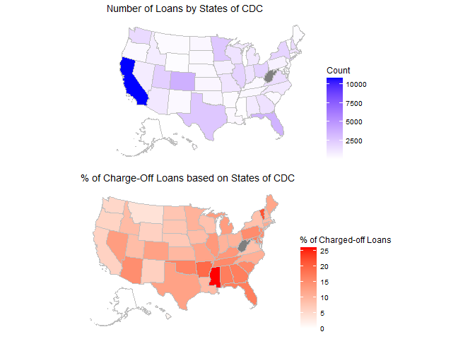<!-- -->

Similar pattern is observed with CDCs’ states. It is due to fact that
usually small business receive loans from organizations from their own
states. This varaible is redundant in machine learning.

### `ThirdPartyLender_State`

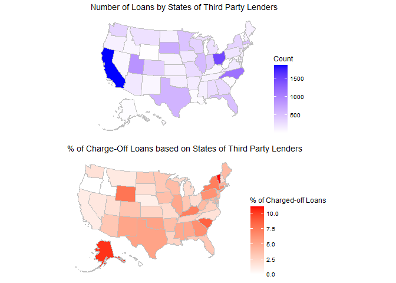<!-- -->

States of the third party lenders are potentially associated with
charged-off rate with the visually observed difference in terms of the
percentage in each state.

### `ApprovalFiscalYear`

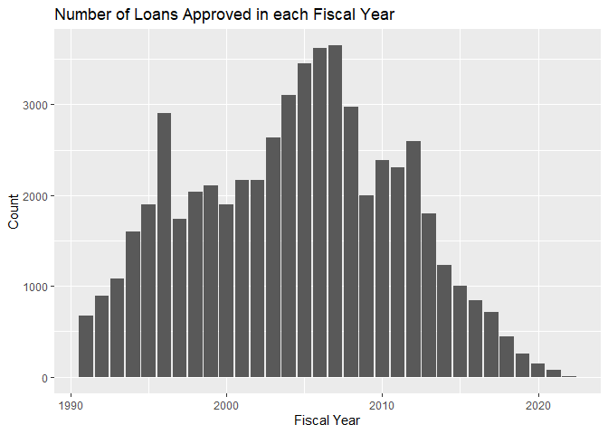<!-- -->

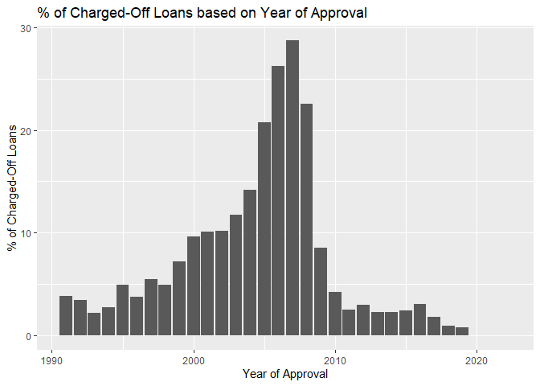<!-- -->

It is observed that more loans were charged off in the year between 2005
to 2009. Still, year of approval will not be a useful feature for us to
study the risk of future small business loans.

### `DeliveryMethod`

<!-- -->

Delviery methods are mostly 504, ALP, and PCLP. The association between
other methods (504 Refinace, 504REFI, and Direct Loans) and chance of a
loan being charged off may not be very robust as the sample sizes are
relatively smaller.

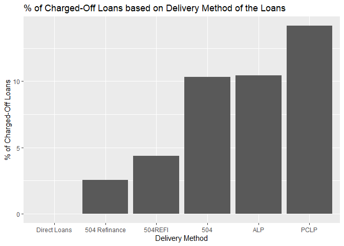<!-- -->

It is visually obvious that some delivery methods are associated with
lower charged-off rate. This may useful in predict loan risks.

### `NaicsCode`

``` r
length( unique( df$NaicsCode))
```

    ## [1] 1131

While there are too many codes in the North American Industry
Classification System, we can extract the sectors by using the first 2
digits of each NAICS code.

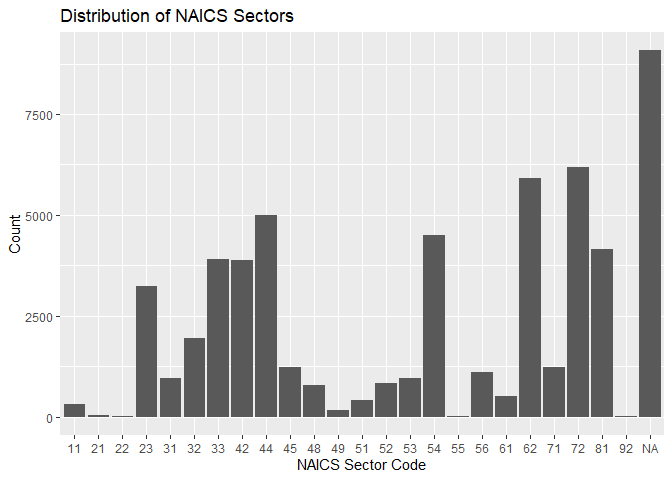<!-- -->

Many observations are without NAICS code provided. While the number of
occurence of NA is large, it is more appropriate to use NAs as a
separate class.

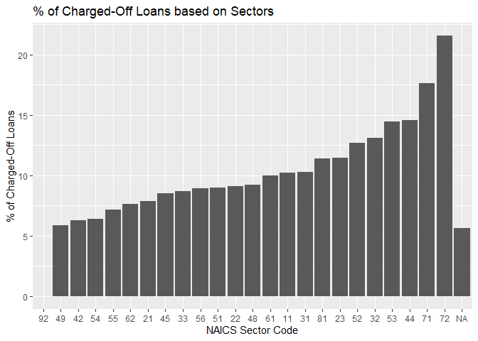<!-- -->

### `FranchiseCode` and `FranchiseName`

``` r
df |>
    group_by( FranchiseCode) |>
    summarise( percentage = n() / nrow( df) * 100) |>
    arrange( desc( percentage)) |>
    head( 3)
```

    ## # A tibble: 3 × 2
    ##   FranchiseCode percentage
    ##   <chr>              <dbl>
    ## 1 <NA>              91.3  
    ## 2 80979              0.318
    ## 3 79140              0.254

``` r
df |>
    group_by( FranchiseName) |>
    summarise( percentage = n() / nrow( df) * 100) |>
    arrange( desc( percentage)) |>
    head( 3)
```

    ## # A tibble: 3 × 2
    ##   FranchiseName       percentage
    ##   <chr>                    <dbl>
    ## 1 <NA>                    91.3  
    ## 2 SUPER 8 MOTEL            0.374
    ## 3 HOLIDAY INN EXPRESS      0.321

While most of the of the observations are not associated with any
franchise, it may be infeasible to use franchise code or name to
prediction loan risk.

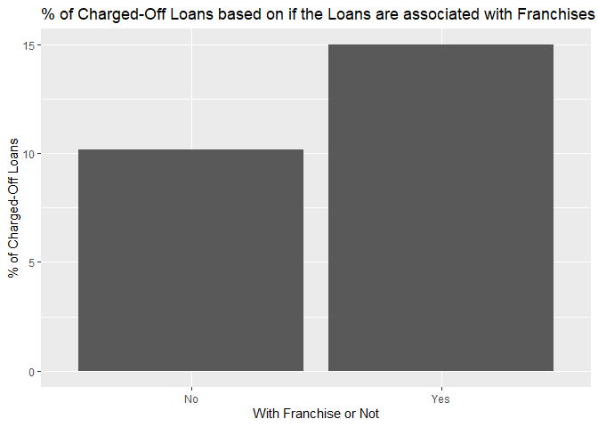<!-- -->

It is possible to that loans associated with existing franchises are
with higher chance of being charged off. It can be a useful feature in
predicting loan risk.

### `ProjectState`

<!-- -->

While borrowers usually use the loans in projects in their own states,
the states of the projects will be a redundant information in predicting
loan risks

### `BusinessType`

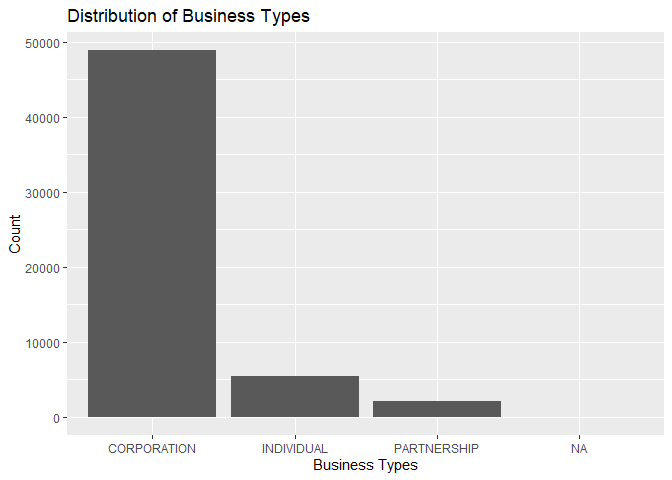<!-- -->

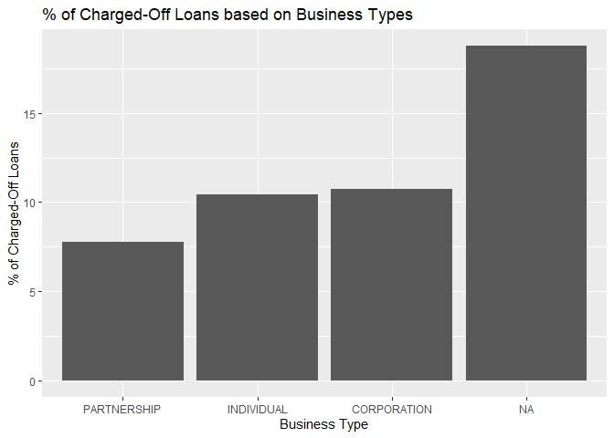<!-- -->

Business not providing their business types seem to be more susceptible
to be charged-off. Loans for business in partnership seem to have lower
charged-off rate. By further inspecting the samples size of each
business type, it should be noted that there is only a small amount of
business having no business type provided. Still, business type is
potentially useful in predicting loan risks.

### `BusinessAge`

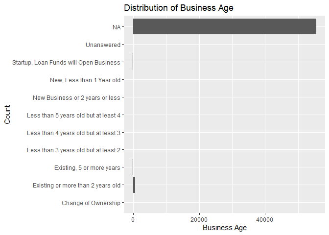<!-- -->

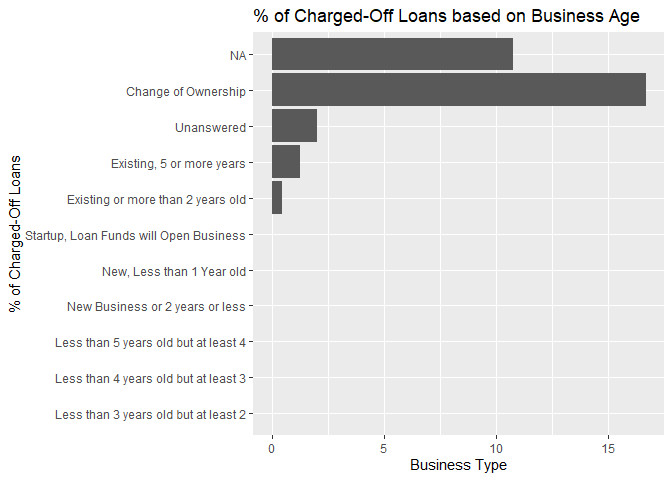<!-- -->

While business age seems to associated with loan status, there are many
null values in the column. This variable will not be useful in
prediction loan risky.

### `ThirdPartyDollars`

``` r
# Calculating the number of observations without a value for thrid party dollars in the data set
sum( is.na( df$ThirdPartyDollars)) / nrow( df) * 100
```

    ## [1] 73.13144

Many observations do not have third party dollars. Imputation will be
performed by replace null values with 0.

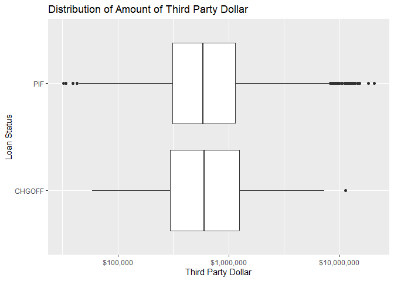<!-- -->

It is possible that loans that are paid in full amount have received
more third party fund. This feature is potentially useful in predicting
loan risk. The practicality of using this variable in prediction is
questionable as companies may apply for SBA loans before receiving money
from third parties. For this project, this variable is considered as a
valid predictor temporally.

### `GrossApproval`

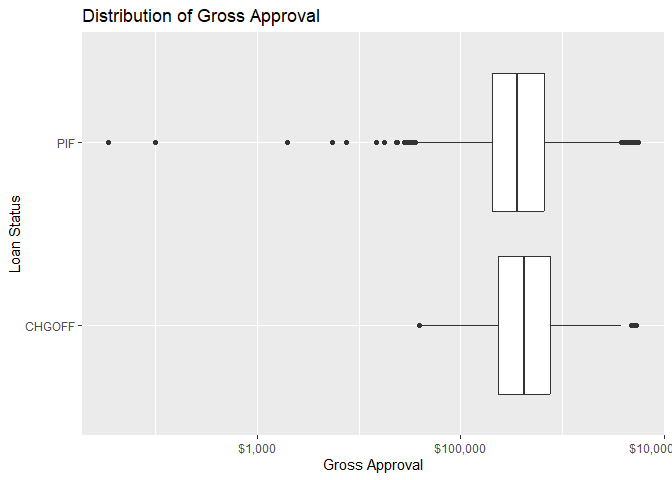<!-- -->

There is not visually obvious difference between 2 types of loans in
terms of the amount approved. In fact, this variable may not be useful
in predict risks in practice as the executives should tune the gross
amount to be approved based on the risk of the loans.

### `TermInMonths`

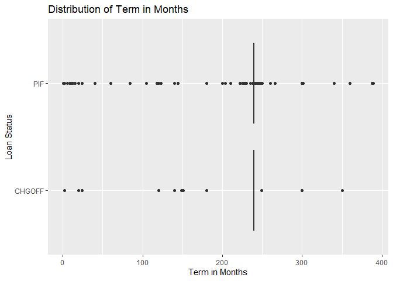<!-- -->

No visual difference is observed in terms of term in months. Still, this
column can be used in machine learning models with feature selection
process applied.

### `GrossChargeOffAmount`

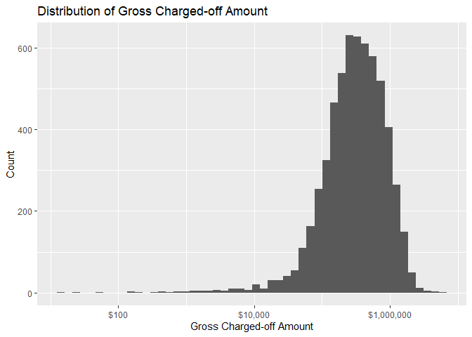<!-- -->

This column in the data set will not be used to predict risks as amount
charged-off is only known only when a loan is charged off.

### `JobsSupported`

<!-- -->

No visual difference is observed in terms of term in months. Still, this
column can be used in machine learning models with feature selection
process applied.

## Variable Selection

Summing up, the variables below are selected in the machine learning
process to provide insight in small business loan risks and to predict
charged-off risk of future loans.

-   `LoanStatus` (as the target variable)
-   `BorrState`
-   `DeliveryMethod`
-   `NaicsCode` (with NAICS sectors extracted)
-   `FranchiseCode` (as a binary variable of whether the loan is
    associated with a franchise)
-   `BusinessType`
-   `BusinessAge`
-   `ThirdPartyDollar`
-   `TermInMonths`
-   `JobsSupported`
