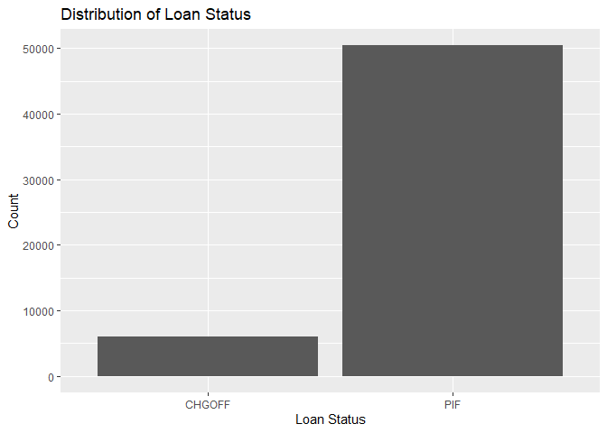
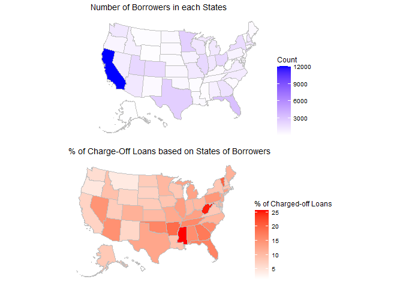

Exploratory Data Analysis
================
Morris M. F. Chan

-   <a href="#exploratory-data-analysis"
    id="toc-exploratory-data-analysis">Exploratory Data Analysis</a>
    -   <a href="#general" id="toc-general">General</a>
        -   <a href="#importing-packages-and-data"
            id="toc-importing-packages-and-data">Importing packages and data</a>
    -   <a href="#individual-variables" id="toc-individual-variables">Individual
        Variables</a>
        -   <a href="#loanstatus" id="toc-loanstatus">LoanStatus</a>
        -   <a href="#borrstate" id="toc-borrstate">BorrState</a>

# Exploratory Data Analysis

## General

### Importing packages and data

``` r
library( tidyverse)
```

    ## ── Attaching packages ─────────────────────────────────────── tidyverse 1.3.2 ──
    ## ✔ ggplot2 3.4.0     ✔ purrr   1.0.1
    ## ✔ tibble  3.1.8     ✔ dplyr   1.1.0
    ## ✔ tidyr   1.3.0     ✔ stringr 1.5.0
    ## ✔ readr   2.1.3     ✔ forcats 1.0.0
    ## ── Conflicts ────────────────────────────────────────── tidyverse_conflicts() ──
    ## ✖ dplyr::filter() masks stats::filter()
    ## ✖ dplyr::lag()    masks stats::lag()

``` r
library( cowplot)
df_1991 = read_csv( '../data/foia-504-fy1991-fy2009-asof-221231.csv')
```

    ## Rows: 111341 Columns: 38
    ## ── Column specification ────────────────────────────────────────────────────────
    ## Delimiter: ","
    ## chr (28): BorrName, BorrStreet, BorrCity, BorrState, BorrZip, CDC_Name, CDC_...
    ## dbl  (9): AsOfDate, Program, ThirdPartyDollars, GrossApproval, ApprovalFisca...
    ## lgl  (1): BusinessAge
    ## 
    ## ℹ Use `spec()` to retrieve the full column specification for this data.
    ## ℹ Specify the column types or set `show_col_types = FALSE` to quiet this message.

``` r
df_2010 = read_csv( '../data/foia-504-fy2010-present-asof-221231.csv')
```

    ## Rows: 96344 Columns: 38
    ## ── Column specification ────────────────────────────────────────────────────────
    ## Delimiter: ","
    ## chr (29): BorrName, BorrStreet, BorrCity, BorrState, BorrZip, CDC_Name, CDC_...
    ## dbl  (9): AsOfDate, Program, ThirdPartyDollars, GrossApproval, ApprovalFisca...
    ## 
    ## ℹ Use `spec()` to retrieve the full column specification for this data.
    ## ℹ Specify the column types or set `show_col_types = FALSE` to quiet this message.

``` r
df = rbind( df_1991, df_2010)
df <- df |>
    select(
    'Program', 'BorrCity', 'BorrState', 'CDC_State', 'ThirdPartyLender_State',  
    'ApprovalFiscalYear', 'DeliveryMethod', 'NaicsCode', 'NaicsDescription', 
    'FranchiseCode', 'FranchiseName', 'ProjectState', 'BusinessType', 'BusinessAge', 'LoanStatus',
    'ThirdPartyDollars', 'GrossApproval', 'TermInMonths', 'GrossChargeOffAmount', 'JobsSupported'
)
```

``` r
for (i in names( df)){
    if ( class( df[[ i]]) == 'character'){
        print( paste( i, length( levels( as.factor( df[[ i]])))))
    }
}
```

    ## [1] "BorrCity 19132"
    ## [1] "BorrState 54"
    ## [1] "CDC_State 51"
    ## [1] "ThirdPartyLender_State 60"
    ## [1] "DeliveryMethod 6"
    ## [1] "NaicsDescription 1237"
    ## [1] "FranchiseCode 2440"
    ## [1] "FranchiseName 2254"
    ## [1] "ProjectState 55"
    ## [1] "BusinessType 3"
    ## [1] "BusinessAge 10"
    ## [1] "LoanStatus 5"

``` r
for ( i in c( 'Program', 'ApprovalFiscalYear')){ # Categorical variables that are not parsed as characters.
    print( paste( i, length( levels( as.factor( df[[ i]])))))
}
```

    ## [1] "Program 1"
    ## [1] "ApprovalFiscalYear 33"

The feature `Program` is completely useless as it only has one class.
This variable will be removed from the data frame.

It is quite weird that number of `NaicsDescrption` and `NaicsCode` do
not match. Also the case with `FranchiseName` and `FranchiseCode`.

``` r
df <- df |>
    select( -Program) |>
    mutate( ApprovalFiscalYear = as.factor( ApprovalFiscalYear)) |>
    mutate_if( is.character, as.factor)
```

We first inspect the target variable of interest.

``` r
df |>
    group_by( LoanStatus) |>
    summarise( Count = n()) |>
    arrange( desc( Count))
```

    ## # A tibble: 6 × 2
    ##   LoanStatus  Count
    ##   <fct>       <int>
    ## 1 PIF        100797
    ## 2 EXEMPT      57161
    ## 3 CANCLD      28722
    ## 4 CHGOFF      11937
    ## 5 NOT FUNDED   8707
    ## 6 <NA>          361

While our major goal is to predict risks of specific loans, we are more
interested in loans that were either Paid in Full (`PIF`) or Charge Off
(`CHGOFF`). Loans that were not approved (`NOT FUNDED`) have not risk
components. Loans that are excepted (`EXEMPT`) or cancelled (`CANCLD`)
are eseentially censored data which we do not know whether the loans
would be paid if they had not been exempted/cancelled. Thus, we only
include observations that are either Paid in Full (`PIF`) or Charge Off
(`CHGOFF`).

``` r
df <- df |>
    filter( (LoanStatus=='PIF') | (LoanStatus=='CHGOFF'))
```

To maintain scientisfic robustness and prevent data leakge, only the
training data set after splitting is visually inspected here. Data
splitting is performed with `src/01-data-splitting.py`.

``` r
df <- read_csv( '../data/train.csv')
```

    ## New names:
    ## Rows: 56367 Columns: 20
    ## ── Column specification
    ## ──────────────────────────────────────────────────────── Delimiter: "," chr
    ## (12): BorrCity, BorrState, CDC_State, ThirdPartyLender_State, DeliveryMe... dbl
    ## (8): ...1, ApprovalFiscalYear, NaicsCode, ThirdPartyDollars, GrossAppro...
    ## ℹ Use `spec()` to retrieve the full column specification for this data. ℹ
    ## Specify the column types or set `show_col_types = FALSE` to quiet this message.
    ## • `` -> `...1`

## Individual Variables

This section examines the distribution of each indiviudal variables and
their associations with the status of the loans.

``` r
options(repr.plot.width=7, repr.plot.height=3)
count_plot <- function( column, data, title, lab, cat_on_x = TRUE){
    data |>
        ggplot() + {
        if (cat_on_x==TRUE)
            aes( x = {{column}})
        else 
            aes( y = {{column}})
        } +
        geom_bar() +
        labs( title = title, x = lab, y = 'Count')
}
```

``` r
# Adding new columns to facilitate data wrangling
df <- df |>
    mutate( pif = case_when( LoanStatus == 'PIF' ~ 1,
                            TRUE ~ 0),
            chgoff = case_when( LoanStatus == 'CHGOFF' ~ 1,
                                TRUE ~ 0)
    )
```

### LoanStatus

``` r
count_plot( LoanStatus, df, title = 'Distribution of Loan Status', lab = 'Loan Status')
```

<!-- -->

There is serious class imbalance between 2 classes of loan status. It
should be handled with cautious when building and evaluating the
relevant machine learning models.

### BorrState

``` r
library(usmap)

state_plot <- function( state_column, data, title = '% of Charge-Off Loans'){
    state_df <- data |>
        mutate( state = {{ state_column}}) |>
        group_by( state) |>
        summarise( chgoff_percentage = round( sum( chgoff) / ( sum( chgoff) + sum( pif)) * 100, 2))
    
    plot_usmap( data = state_df, values = 'chgoff_percentage', color = 'gray') +
        scale_fill_continuous(
            low = "White", high = "Red", name = "% of Charged-off Loans"
        ) +
        theme(legend.position = "right") +
        labs( title = title)
}

state_count_plot <- function( state_column, data, title = 'Number of Occurence in each State'){
    state_df <- data |>
        mutate( state = {{ state_column}}) |>
        group_by( state) |>
        summarise( n = n())
    
    plot_usmap( data = state_df, values = 'n', color = 'gray') +
        scale_fill_continuous(
            low = "white", high = "blue", name = "Count"
        ) +
        theme(legend.position = "right") +
        labs( title = title)
}
```

``` r
options(repr.plot.width=7, repr.plot.height=5)
count_ <- state_count_plot( BorrState, df, title = 'Number of Borrowers in each States')
percentage_ <- state_plot( BorrState, df, title = '% of Charge-Off Loans based on States of Borrowers')
plot_grid( count_, percentage_, ncol = 1)
```

<!-- -->

While it is visually significant that loans in some states are more
probable to be charged off, it should be noted that most of the loans
are associated with business in California. Some states with high
percentage of charged-off loans (e.g., Mississippi) are with small
sample sizes. The observed high risk of loans may not be a robust
measurement because of the large variance in the sampling process.
